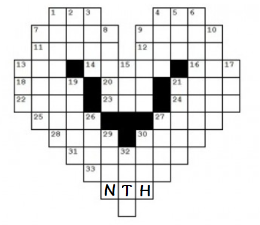

CS480 Introduction to Artificial Intelligence (Fall, 2022)
Assignment 3

Due: Thursday, Nov. 1, 2022
Total Points: 100

1.	Crossword Designer

You are asked to design a program to design crossword. The following is a simple crossword. Given the list of words:

AFT	LASER
ALE	LEE
EEL	LINE
HEEL	SAILS
HIKE	SHEET
HOSES	STEER
KEEL	TIE
KNOT
                
    +---+---+---+---+---+
    | 1 |   | 2 |   | 3 |		
    +---+---+---+---+---+		
    | # | # |   | # |   |		
    +---+---+---+---+---+		
    | # | 4 |   | 5 |   |		
    +---+---+---+---+---+		
    | 6 | # | 7 |   |   |		
    +---+---+---+---+---+		
    | 8 |   |   |   |   |
    +---+---+---+---+---+	
    |   | # | # |   | # |       
    +---+---+---+---+---+       

The numbers 1,2,3,4,5,6,7,8 in the puzzle correspond to the words that will start at those locations.

The variables can be represented in the following table with the specific domain.

	VARIABLE | STARTING CELL | DOMAIN
	================================================
	1ACROSS	 | 1		 | {HOSES, LASER, SAILS, SHEET, STEER}
	4ACROSS	 | 4		 | {HEEL, HIKE, KEEL, KNOT, LINE}
	7ACROSS	 | 7		 | {AFT, ALE, EEL, LEE, TIE}
	8ACROSS	 | 8		 | {HOSES, LASER, SAILS, SHEET, STEER}
	2DOWN	 | 2		 | {HOSES, LASER, SAILS, SHEET, STEER}
	3DOWN	 | 3		 | {HOSES, LASER, SAILS, SHEET, STEER}
	5DOWN	 | 5		 | {HEEL, HIKE, KEEL, KNOT, LINE}
	6DOWN	 | 6		 | {AFT, ALE, EEL, LEE, TIE}

Task 1. Backtracking (30 pts)
Specify the constraints among variables. Implement a simple backtracking algorithm to come up with a solution for the above puzzle.

Task 2. Larger puzzle. (40 pts)
Now, let’s consider a bigger puzzle with more words. Words.txt file contains ~21,000 pocket English diction words. Now you are asked to design the following puzzle. Notice that this crossword puzzle is much bigger and harder than the one in task one. Specify constraints among variables. You need to design a smarter backtracking algorithm using at least one of the heuristics we discussed in class (MRV, degree heuristics, least constraining value, forward checking).
 

 

Task 3: Analysis (30 pts)
Compare the performance of your program using different heuristics with simple backtracking algorithms on puzzles of different sizes. You can use any word puzzles and you do not have to limit to the puzzles provided above.

What to Hand in
1.	Well documented codes implementing the crossword designer program. The crossword designer program should print out the output of the two puzzles as well as the timing. A README file should provide instructions on how to compile and execute the code.
2.	An assignment report with solutions you obtained for the crossword designer program for the puzzles provided in this assignment. You are welcome to provide solutions for any other puzzles you selected. Provide your performance analysis of the heuristics you use.

Please turn in your assignment via canvas before the assignment due date.
 
